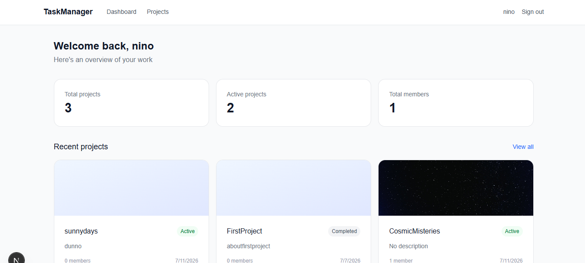
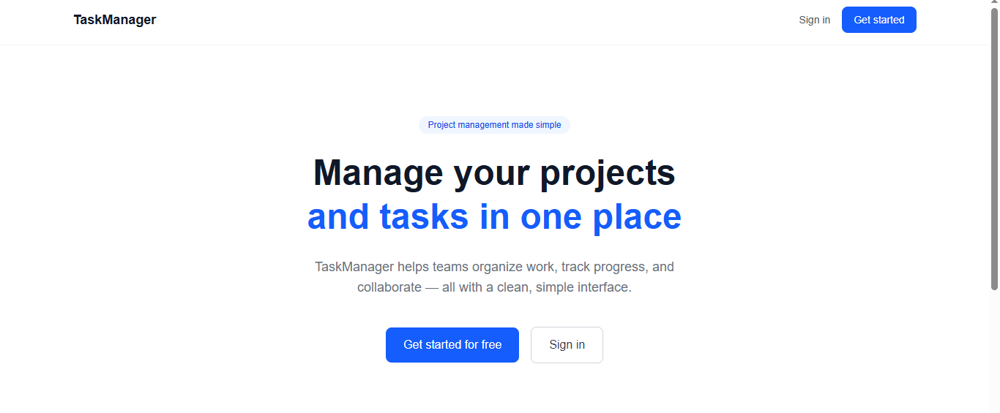
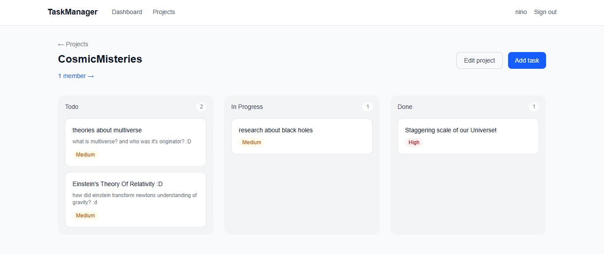

# TaskManager

A full-stack project management application built with Next.js and ASP.NET Core. Organize work with Kanban boards, collaborate with team members, and track progress across projects.

## Live demo

🔗 [taskmanager-nino77.vercel.app](https://task-manager-nino77.vercel.app/)

> **Note:** The backend runs on Render's free tier and may take 20-30 seconds to wake up on the first request after a period of inactivity. Subsequent requests will be fast.



## Features

- **Authentication** — Secure register and login with JWT tokens and BCrypt password hashing
- **Projects** — Create and manage projects with cover images, descriptions, and status tracking
- **Kanban boards** — Visualize tasks across Todo, In Progress, and Done columns
- **Task management** — Create tasks with priority levels, assignees, and due dates
- **Team collaboration** — Invite members to projects by email, manage roles
- **Comments** — Threaded comments on individual tasks
- **Image uploads** — Project cover images stored and optimized via Cloudinary

## Tech stack

### Frontend

- Next.js 16 (App Router)
- TypeScript
- Tailwind CSS v4
- TanStack Query — server state management
- Zustand — client state management
- React Hook Form — form validation
- Axios — HTTP client with JWT interceptor

### Backend

- ASP.NET Core (.NET 8)
- Entity Framework Core 9
- PostgreSQL
- JWT authentication
- BCrypt password hashing
- Cloudinary — image storage and optimization
- Swagger — API documentation

## Getting started

### Prerequisites

- Node.js 20+
- .NET 8 SDK
- PostgreSQL 16
- Cloudinary account (free tier works)

### Backend setup

1. Navigate to the backend folder:

```bash
cd backend
```

2. Copy the example config and fill in your values:

```bash
cp appsettings.example.json appsettings.json
```

3. Update `appsettings.json` with your PostgreSQL connection string, JWT secret, and Cloudinary credentials.

4. Create the database:

```bash
psql -U postgres -c "CREATE DATABASE taskmanager"
```

5. Run migrations:

```bash
dotnet ef database update
```

6. Start the API:

```bash
dotnet run
```

The API will be available at `https://localhost:7192`. Swagger docs at `https://localhost:7192/swagger`.

### Frontend setup

1. Navigate to the frontend folder:

```bash
cd frontend
```

2. Install dependencies:

```bash
npm install
```

3. Update the `baseURL` in `src/lib/axios.ts` to match your backend port.

4. Start the dev server:

```bash
npm run dev
```

The app will be available at `http://localhost:3000`.

## API endpoints

### Auth

| Method | Endpoint             | Description             |
| ------ | -------------------- | ----------------------- |
| POST   | `/api/auth/register` | Register a new user     |
| POST   | `/api/auth/login`    | Login and get JWT token |

### Projects

| Method | Endpoint                   | Description                       |
| ------ | -------------------------- | --------------------------------- |
| GET    | `/api/projects`            | Get all projects for current user |
| POST   | `/api/projects`            | Create a new project              |
| GET    | `/api/projects/{id}`       | Get project by ID                 |
| PUT    | `/api/projects/{id}`       | Update project                    |
| DELETE | `/api/projects/{id}`       | Delete project                    |
| PATCH  | `/api/projects/{id}/image` | Update project cover image        |

### Tasks

| Method | Endpoint                            | Description                 |
| ------ | ----------------------------------- | --------------------------- |
| GET    | `/api/projects/{id}/tasks`          | Get all tasks for a project |
| POST   | `/api/projects/{id}/tasks`          | Create a new task           |
| GET    | `/api/projects/{id}/tasks/{taskId}` | Get task by ID              |
| PUT    | `/api/projects/{id}/tasks/{taskId}` | Update task                 |
| DELETE | `/api/projects/{id}/tasks/{taskId}` | Delete task                 |

### Members

| Method | Endpoint                                | Description             |
| ------ | --------------------------------------- | ----------------------- |
| GET    | `/api/projects/{id}/members`            | Get all project members |
| POST   | `/api/projects/{id}/members`            | Add member by email     |
| DELETE | `/api/projects/{id}/members/{memberId}` | Remove member           |

### Comments

| Method | Endpoint                               | Description                 |
| ------ | -------------------------------------- | --------------------------- |
| GET    | `/api/tasks/{id}/comments`             | Get all comments for a task |
| POST   | `/api/tasks/{id}/comments`             | Add a comment               |
| DELETE | `/api/tasks/{id}/comments/{commentId}` | Delete a comment            |

### Images

| Method | Endpoint            | Description                   |
| ------ | ------------------- | ----------------------------- |
| POST   | `/api/image/upload` | Upload an image to Cloudinary |

## Screenshots

| Landing page                          | Dashboard                                 | Kanban board                        |
| ------------------------------------- | ----------------------------------------- | ----------------------------------- |
|  |  |  |
